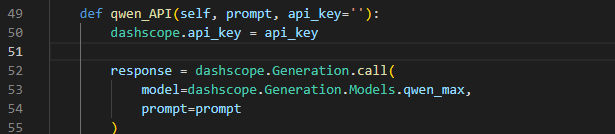
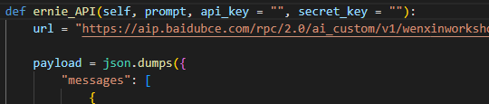
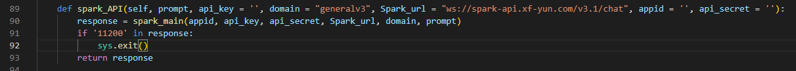
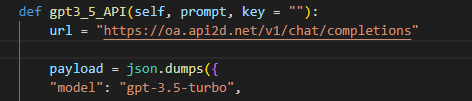

# 使用方法

按需修改数据文件路径，然后直接运行main.py

# 支持的闭源模型
1. 通义千问
使用时填入api_key即可

2. 文心一言
使用时填入api_key,secret_key即可

3. 星火大模型
使用时填入api_key,appid,api_secret即可

4. GPT3.5
使用时填入key即可

5. GPT4
同GPT3.5

# 支持断点续运行
中断后直接重新运行main.py即可，无需多余操作

# 支持zero-shot和few-shot